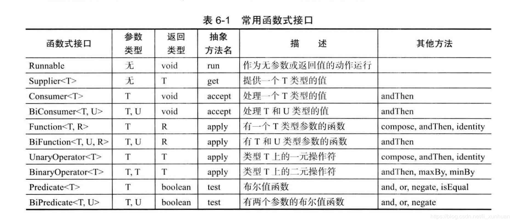

# `javatest`

###Java-Lambda表达式和“方法引用”的对比和详解
[Java-Lambda表达式和“方法引用”的对比和详解][https://cloud.tencent.com/developer/article/1532870]

###常用函数式接口

[https://cloud.tencent.com/developer/article/1532870]: https://cloud.tencent.com/developer/article/1532870